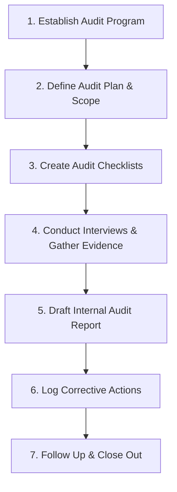

# ISO Internal Audit & Readiness Playbook

This playbook is designed for the internal project team (ISO coordinators, internal auditors, and process owners) to manage the **Internal Audit Process** (a mandatory requirement under Clause 9.2 of all ISO standards) and complete a **Readiness Check** before the external auditors arrive.

---

## Part 1: The Internal Audit Process (Clause 9.2)

An internal audit is a formal, objective review of your Management System. It must be conducted by someone who is **independent** of the process being audited (e.g., the HR manager audits IT, or IT audits Finance).

### 1. Establish the Audit Program
* **Frequency:** Typically once per year, or split into quarterly cycles covering different departments.
* **Document Required:** *Annual Internal Audit Schedule* showing when each department will be audited.

### 2. Define the Audit Plan & Scope
* Send an **Audit Plan** to the auditees at least 1 week in advance, stating:
  * Audit Date and Time.
  * Clauses to be audited.
  * Expected evidence (e.g., records of the last 6 months).

### 3. Create Audit Checklists
Prepare a set of questions mapped to your internal policies and the ISO standard clauses. 
* *Example Question:* "How do you ensure new employees are trained on security policies?" (Auditing Clause 7.2 Competency).
* *Target Evidence:* Training logs, onboarding checklists, certificates.

### 4. Conduct the Audit
* **Opening Meeting:** Briefly explain the goal (finding facts, not faults).
* **Investigation:** Interview process owners, view system screens, and request samples.
* **Closing Meeting:** Highlight what is working well and share any gaps discovered.

### 5. Draft the Internal Audit Report
The report must document:
- **Strengths:** Positive observations of compliant practices.
- **Minor/Major Non-Conformities (NCs):** Areas where standard requirements or internal policies were not met.
- **Opportunities for Improvement (OFIs):** Suggestions to optimize processes.

### 6. Corrective Actions & Closure
- Process owners must complete a **Corrective Action Plan** for all internal NCs.
- Internal auditor must verify the fixes before the external audit begins.

---

## Part 2: Pre-External Audit Readiness Check (Last-Mile Prep)

This checklist should be executed **2 to 4 weeks prior** to the external auditor's arrival. It functions as a mock check to ensure the team is prepared.

### 📋 The Readiness Checklist

- [ ] **1. Evidence Audit Trail Verification**
  * Check that all records (logs, reviews, tickets) from the past 3 to 6 months are complete and signed off.
  * Ensure no "draft" watermarks exist on active, approved policies.
- [ ] **2. Management Review Meeting (MRM) Records**
  * Confirm that a formal MRM has taken place *after* the internal audit.
  * Ensure the minutes are signed and action items are assigned with deadlines.
- [ ] **3. Internal Audit Closure**
  * Ensure all Non-Conformities raised during the internal audit are either fully closed or have active, approved Action Plans with progress updates.
- [ ] **4. Logistics & Access Checks**
  * Ensure the auditor has visitor badges, a quiet workspace, internet access, and screen-sharing tools.
  * Verify that internal systems (ticketing systems, documentation portals) can be accessed smoothly for live demonstrations.
- [ ] **5. Staff Coaching Session**
  * Hold a briefing meeting for all staff members who may be interviewed by the auditor (see coaching tips below).

---

## Part 3: Auditor Interview Coaching Tips for Staff

External auditors do not just talk to the ISO project lead; they walk the floor and interview random employees. Use these guidelines to prep your team:

> [!TIP]
> **Staff Coaching Rules of Thumb:**
> 1. **Be Honest:** If you do not know the answer, say: *"I do not know, but I know exactly where to find it in our documentation, or I know who to ask."* Never guess.
> 2. **Answer Only What is Asked:** Keep answers concise. Do not volunteer extra, unsolicited information, as this often leads the auditor down new audit paths.
> 3. **Show, Don't Just Tell:** Keep your dashboard, system logins, or folders open. If you explain a process, show the auditor a real-world example on screen.
> 4. **Know the Policies:** Staff must know where the company Policy (e.g., Security or Quality Policy) is located on the intranet and understand their role in achieving its goals.
