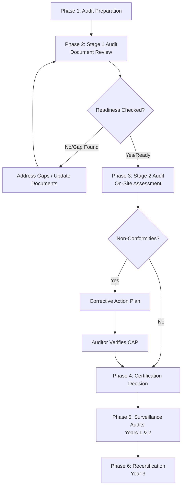

# ISO Certification Audit Guide

This guide provides a comprehensive overview of how ISO certification audits are conducted, what auditors look for, and how requirements differ across key ISO standards.

---

## 1. The ISO Audit Lifecycle (How It's Done)

An ISO certification audit is structured into distinct phases to ensure an organization's Management System is both documented and actively practiced.

### Phase 1: Audit Preparation & Planning
* **Internal Audit:** Before the external auditor arrives, you must conduct an internal audit of all processes to verify compliance.
* **Management Review:** Leadership must review the management system to confirm it aligns with business goals.
* **Auditor Selection:** Hire an accredited third-party certification body (Registrar).

### Phase 2: Stage 1 Audit (Readiness Review)
* **Objective:** The auditor reviews your documented information to verify that system design meets standard requirements.
* **Method:** Primarily a desk-based review of policies, procedures, scope statements, and records.
* **Outcome:** A readiness report highlighting gaps that must be resolved before proceeding.

### Phase 3: Stage 2 Audit (The Certification Audit)
* **Objective:** Verify that the organization actually practices what is written in its documentation.
* **Method:** On-site (or remote) interviews, observation of daily operations, and sampling of records.
* **Key Events:**
  * **Opening Meeting:** Setting expectations and confirming the audit scope.
  * **Evaluation:** Gathering evidence through interviews and system tests.
  * **Closing Meeting:** Presentation of audit findings and classifications.

### Phase 4: Reporting & Findings Classification
Auditors classify findings into three main categories:

| Finding Type | Description | Action Required |
| :--- | :--- | :--- |
| **Major Non-Conformity** | A systemic failure to meet a requirement of the standard (e.g., completely missing internal audits). | Must be corrected, verified, and closed before certification can be granted. |
| **Minor Non-Conformity** | A single, isolated lapse in complying with a procedure (e.g., one employee missing training records). | Must submit a Corrective Action Plan (CAP). Certification can be approved pending closure. |
| **Observation / OFI** | Opportunities for Improvement where the system complies but could be optimized. | Optional to address; monitored in future audits. |

### Phase 5: Surveillance Audits (Years 1 & 2)
ISO certificates are valid for **3 years**. In years 1 and 2, shorter "surveillance audits" are conducted to ensure continuous compliance and improvement.

### Phase 6: Recertification (Year 3)
A full system evaluation is conducted to renew the certificate for another 3-year cycle.

---

## 2. What Auditors Look For (Common Checklist Areas)

Regardless of the specific ISO standard, auditors use the **PDCA (Plan-Do-Check-Act)** cycle and look for evidence in these core areas:

> [!IMPORTANT]
> Auditors look for **objective evidence** (records, logs, screenshots, observed actions). Verbal assurances are not sufficient.

### A. Leadership & Commitment (Clause 5)
* **Management Reviews:** Minutes, attendance lists, and action items demonstrating leadership involvement.
* **Policy Alignment:** A signed policy document that is communicated throughout the organization.
* **Roles & Responsibilities:** Clearly defined job descriptions and organizational charts.

### B. Risk & Opportunity Management (Clause 6)
* **Risk Registers:** Identification of business, operational, or information risks.
* **Mitigation Plans:** Actions taken to address risks, with evidence of implementation.

### C. Competence & Awareness (Clause 7)
* **Training Records:** Onboarding documentation, certificates, and skills matrices.
* **Awareness:** Randomly selected employees are interviewed to test their knowledge of the company's quality/security policies.

### D. Documented Information Control (Clause 7.5)
* **Version Control:** Clear review/approval workflows for policies and procedures.
* **Retention Policies:** Controlled storage, archiving, and secure disposal of records.

### E. Internal Audits & Corrective Actions (Clauses 9 & 10)
* **Audit Schedules & Reports:** Evidence of periodic internal assessments.
* **Corrective Actions:** Logs showing how root-cause analysis is conducted for errors, and how recurrences are prevented.

---

## 3. Differences Between Requirements (Standard Comparisons)

While all modern ISO standards share the same **High-Level Structure (Annex SL)**, their core focus and operational requirements vary significantly:

| Standard | Focus Area | Unique Key Requirements | Typical Audit Targets |
| :--- | :--- | :--- | :--- |
| **ISO 9001**  *(Quality)* | Customer satisfaction, operational efficiency, and process consistency. | • Customer feedback collection. • Calibration of measurement tools. • Supplier performance evaluations. | Production lines, customer service, supply chain, QA teams. |
| **ISO 27001**  *(Information Security)* | Confidentiality, Integrity, and Availability of data. | • Statement of Applicability (SoA) mapping controls. • Penetration testing & vulnerability scans. • Access control & encryption logs. | IT, DevOps, HR (background checks), Physical Security (server rooms). |
| **ISO 14001**  *(Environmental)* | Minimizing ecological footprint and legal compliance. | • Aspect and Impact Registry (how activities affect nature). • Waste disposal logs & chemical storage protocols. • Emergency spill response drills. | Facilities management, manufacturing sites, waste handlers. |
| **ISO 45001**  *(Health & Safety)* | Preventing workplace injury and promoting health. | • Worker consultation and participation (safety committees). • Hazard identification & incident investigations. • PPE compliance checks. | Shop floors, construction sites, field offices. |

---

## 4. Key Implementation Advice

> [!TIP]
> **Keep it Simple:** Write procedures that match what you *actually do*, rather than creating complex, aspirational policies you cannot sustain.
> **Root Cause is Critical:** When documenting corrective actions, focus on *why* a failure occurred (using techniques like the 5 Whys), not just *what* happened.
