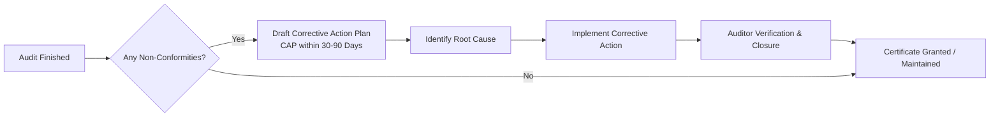

# Universal ISO Audit Plan Template

This audit plan is designed around the **Annex SL High-Level Structure (HLS)**, the common framework shared by all modern ISO standards (including ISO 9001, ISO 27001, ISO 14001, and ISO 45001). This structure ensures that this plan can be adapted to audit *any* ISO certification.

---

## 1. Audit Metadata & Scope

| Field | Description / Template Value |
| :--- | :--- |
| **Organization Name** | [Insert Company Name] |
| **Audit Standard(s)** | [e.g., ISO 9001:2015, ISO 27001:2022, etc.] |
| **Audit Type** | [Internal Audit / Stage 1 / Stage 2 / Surveillance] |
| **Audit Objectives** | 1. Verify compliance of the Management System with the standard requirements. 2. Evaluate the effectiveness of the system in achieving objectives. 3. Identify opportunities for improvement. |
| **Audit Scope** | All operations, locations, and departments within the certified boundary: [Define boundaries, e.g., "All IT Operations in the HQ Office"]. |
| **Lead Auditor** | [Insert Lead Auditor Name] |
| **Audit Date(s)** | [Insert Dates] |

---

## 2. Pre-Audit Readiness Checklist

Before commencing the audit, the Auditor/Audit Coordinator must ensure the following are complete:

- [ ] **Audit Scope Defined:** Boundaries of the certified system are documented.
- [ ] **Document Review:** Previous audit reports, policies, and procedures are available.
- [ ] **Internal Audit Done:** Evidence that the system has been internally audited at least once.
- [ ] **Management Review Conducted:** Executive meeting minutes and actions are ready.
- [ ] **Logistics Confirmed:** Interviewees scheduled, meeting rooms/video links set up.

---

## 3. Universal Audit Schedule (HLS-Mapped)

This schedule covers a typical **2-day audit** structure. It maps standard clauses to functional business areas and evidentiary requirements.

### Day 1: Foundation, Strategy, and Support

| Time | Session & Clause Focus | Key Evidentiary Inputs (What to look for) | Target Auditees |
| :--- | :--- | :--- | :--- |
| **09:00 - 09:30** | **Opening Meeting** | • Introductions, audit plan confirmation, safety briefing, and resource check. | Leadership Team, Auditor, Audit Coordinator |
| **09:30 - 10:30** | **Context & Leadership**  *(Clauses 4 & 5)* | • Context analysis (SWOT / PESTLE). • Interested parties and their requirements. • Scope definition document. • Signed Management Policy. | CEO, Executive Sponsors, Quality/Security Manager |
| **10:30 - 12:00** | **Planning & Objectives**  *(Clause 6)* | • Risk & opportunity assessment registries. • Management objectives (SMART goals) and tracking logs. | Risk Officers, Department Heads |
| **12:00 - 13:00** | **Lunch Break** | — | — |
| **13:00 - 14:30** | **Resources & Support**  *(Clause 7)* | • Competency records (training certificates, CVs). • Onboarding and awareness evidence. • Infrastructure maintenance & calibration records. | HR Manager, Facilities Manager |
| **14:30 - 16:30** | **Documented Information**  *(Clause 7.5)* | • Policy review and approval workflows. • Document creation, control, and storage logs. • Archive and secure destruction procedures. | Document Controller, IT Administrator |
| **16:30 - 17:00** | **Day 1 Wrap-up** | • Summary of Day 1 observations and alignment on Day 2 schedule. | Audit Coordinator, Lead Auditor |

---

### Day 2: Operations, Evaluation, and Improvement

| Time | Session & Clause Focus | Key Evidentiary Inputs (What to look for) | Target Auditees |
| :--- | :--- | :--- | :--- |
| **09:00 - 09:15** | **Day 2 Opening** | • Confirming the agenda and addressing any outstanding Day 1 items. | Audit Coordinator, Lead Auditor |
| **09:15 - 12:00** | **Operational Control**  *(Clause 8)* | • Core process execution (e.g., service delivery, code release, manufacturing). • Change management logs. • Supplier/vendor assessment records. • Emergency preparedness and response logs. | Operations Managers, Line Staff, IT/DevOps Leads |
| **12:00 - 13:00** | **Lunch Break** | — | — |
| **13:00 - 14:30** | **Performance Evaluation**  *(Clause 9)* | • Key Performance Indicators (KPIs) monitoring. • Customer satisfaction surveys & analysis. • Internal Audit schedule, reports, and tracking. | Quality/Security Manager, Business Analysts |
| **14:30 - 15:30** | **Management Review**  *(Clause 9.3)* | • Management Review Meeting (MRM) agenda, minutes, and action plans. | CEO, Executive Sponsors |
| **15:30 - 16:30** | **Improvement**  *(Clause 10)* | • Non-conformity logs. • Corrective Action Plans (root-cause analysis examples). • Continuous improvement initiative tracker. | Quality/Security Manager, Process Owners |
| **16:30 - 17:00** | **Closing Meeting** | • Presentation of findings, classification of Non-Conformities (NCs), and next steps. | Leadership Team, Auditor, Audit Coordinator |

---

## 4. Post-Audit Workflow

1. **Root Cause Analysis (RCA):** For any Non-Conformities found, use the *5 Whys* or *Fishbone (Ishikawa) Diagram* to isolate why the failure occurred.
2. **Corrective Action Plan (CAP):** Submit a formal document detailing what immediate correction was taken, the root cause identified, and the preventative measures established.
3. **Evidence Submission:** Send photos, revised documents, logs, or system screenshots to the auditor showing the action has been closed out.
